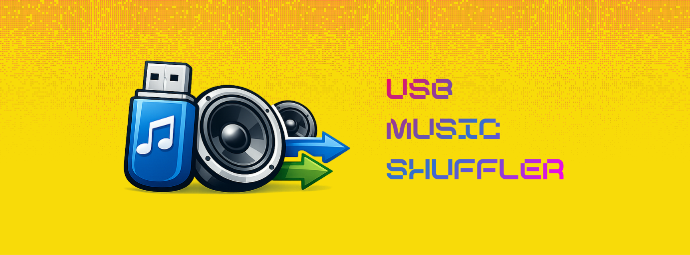
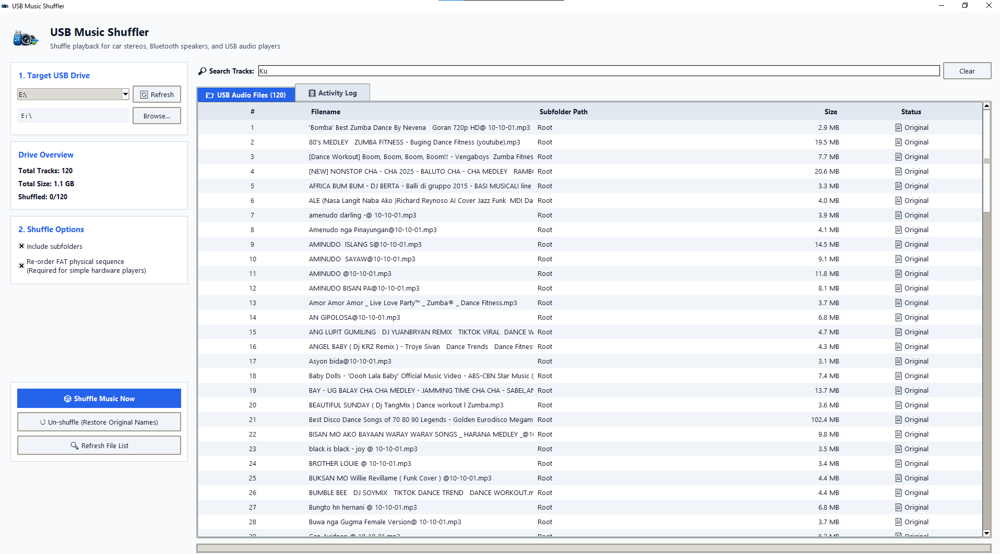
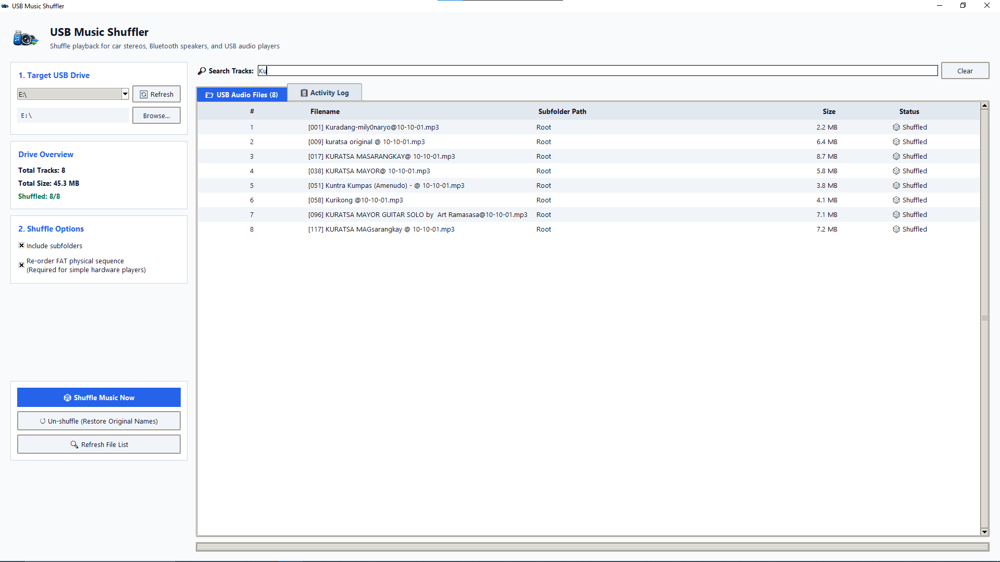
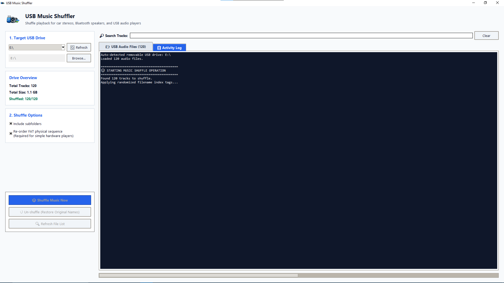
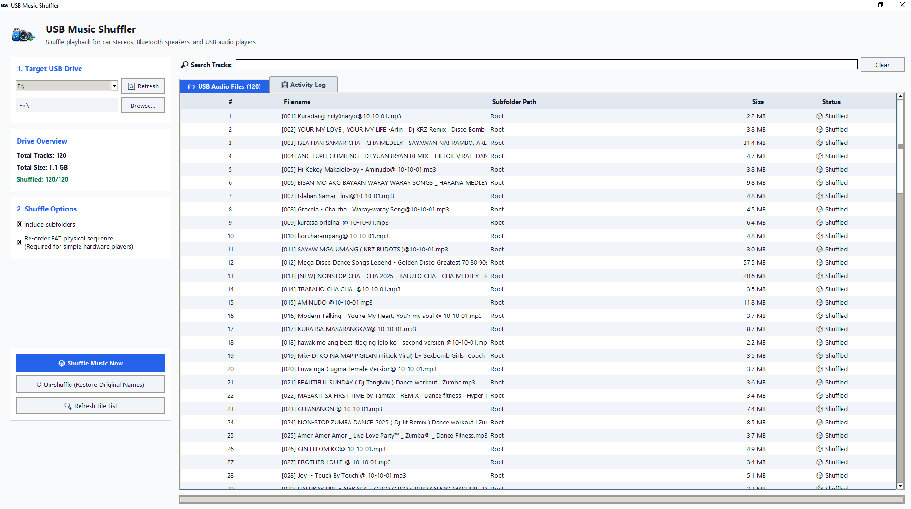
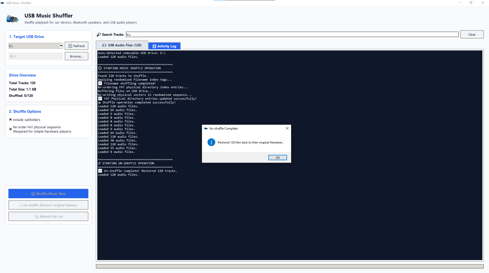

# 🎵 USB Music Shuffler

[](CHANGELOG.md)
[](https://www.python.org/downloads/)
[](LICENSE)
[]()

> An ultra-fast, high-contrast, rock-solid desktop application to shuffle music playback for car stereos, Bluetooth speakers, TVs, soundbars, and standalone USB audio players.

---

## 📸 Application Screenshots

| 1. Original Audio Track List | 2. Real-Time Track Search |
| :---: | :---: |
|  |  |

| 3. Active Shuffle Operation | 4. Shuffled Tracks Preview |
| :---: | :---: |
|  |  |

| 5. Restore to Original Track Names (Un-shuffle) |
| :---: |
|  |

---

## ⚡ The Problem

When you plug a standard USB flash drive into a **car stereo, Bluetooth speaker, or soundbar**:
1. **No Script Execution**: Devices run simple embedded firmware. They **cannot** execute `.bat`, `.exe`, `autorun.inf`, or `.py` scripts.
2. **Fixed Sorting**: Most devices play tracks strictly by **Alphabetical Filename Order** or **Physical FAT Directory Entry Order** (the sequence files were saved to the drive).
3. **No Built-in Shuffle**: Many car stereos and portable USB speakers lack a random/shuffle button.

---

## ✨ Features & Solution

**USB Music Shuffler** reorganizes track names and physical FAT sector sequences on your USB drive so **any USB audio player** is forced to play your music in a fresh, randomized order!

- **🎲 Filename Prefix Shuffling**: Pre-pends randomized index tags (e.g., `[001] Song.mp3`, `[042] Track.mp3`) so devices that sort alphabetically play songs in random order.
- **💾 Physical FAT Directory Re-ordering**: Physically re-writes directory entries on the USB drive in a randomized order to force devices that play by creation/sector sequence to shuffle.
- **🛡️ Automatic Rollback Recovery**: Safe FAT re-ordering engine that automatically restores files if a disk error occurs midway. Zero data loss guarantee!
- **⚡ Scandir Speed Acceleration**: Uses native directory scanning for instant loading, even on large drives with thousands of tracks.
- **🔎 Real-Time Track Search Bar**: Instantly filter and search through all tracks on your USB drive.
- **🖥️ Windows Taskbar Integration**: Custom logo displays in both the titlebar and Windows Taskbar.
- **↺ One-Click Un-shuffle**: Restores original filenames with a single click.
- **🔌 Auto USB Detection**: Automatically detects removable drives on Windows, macOS, and Linux.
- **🎧 Broad Audio Format Support**: Supports `.mp3`, `.wav`, `.flac`, `.m4a`, `.aac`, `.wma`, `.ogg`, and `.opus`.

---

## 🚀 Quick Start

### Option A: Run with Python
```bash
# 1. Clone the repository
git clone https://github.com/EldrexDelosReyesBula/usb-music-shuffler.git
cd usb-music-shuffler

# 2. Install dependencies
pip install -r requirements.txt

# 3. Launch the application
python usb_shuffler.py
```

### Option B: Build Standalone Windows (.exe) Executable
To package into a single standalone `.exe` file without needing Python installed:
```bash
pip install pyinstaller
pyinstaller --noconfirm --onefile --windowed --icon="usb-shuffler-logo.png" --add-data "usb-shuffler-logo.png;." usb_shuffler.py
```
Your executable will be created in `dist/usb_shuffler.exe`.

---

## 📖 How to Use

1. **Plug in your USB drive** to your computer.
2. **Launch the app** (`python usb_shuffler.py` or double-click `usb_shuffler.exe`).
3. **Select your USB Drive** from the drop-down menu (or click **Browse...**).
4. View all detected audio tracks in the **📂 USB Audio Files List** tab.
5. Click **"🎲 Shuffle Music Now"**.
6. Eject the USB drive, plug it into your speaker or car stereo, and enjoy shuffled playback!
7. To revert track names back to original, plug the drive back into your PC and click **"↺ Un-shuffle"**.

---

## 📁 Repository Structure

```
usb-music-shuffler/
├── public/
│   ├── music-shuffler.png
│   └── screenshots/
│       ├── orig-music-list.png
│       ├── search-music.png
│       ├── shuffling-music.png
│       ├── shuffled-music.png
│       └── restore-music-orig-name.png
├── usb_shuffler.py           # Main Tkinter Desktop Application
├── usb-shuffler-logo.png     # Official Application Logo & Icon Asset
├── requirements.txt          # Python dependencies (Pillow)
├── README.md                 # Project Overview & Usage Guide
├── CHANGELOG.md              # Version History & Semantic Versioning Release Notes
├── .gitignore                # Git Ignore Rules
└── LICENSE                   # MIT License
```

---

## 📝 Changelog

See [CHANGELOG.md](CHANGELOG.md) for full version release notes following [Semantic Versioning](https://semver.org/).

---

## 🤝 Contributing

Contributions, issues, and feature requests are welcome! Feel free to check the [issues page](https://github.com/EldrexDelosReyesBula/usb-music-shuffler/issues).

---

## 📄 License

Distributed under the MIT License. See [LICENSE](LICENSE) for more information.
